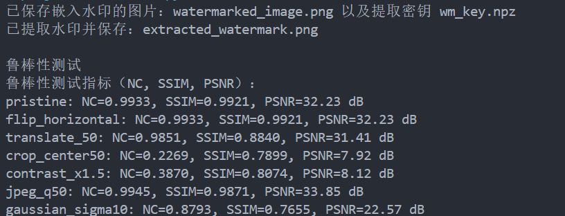

# Project2

## 一、算法概述

本实现采用**离散小波变换（DWT）** 与 **奇异值分解（SVD）** 相结合的方法：

1. 将彩色图像转换到 YCrCb（或 YCbCr）色彩空间，仅对亮度通道 Y 进行处理（减少颜色失真）；

2. 对 Y 通道做单层二维 DWT（Haar），得到低频子带 LL（和高频子带 LH、HL、HH）；

3. 对 LL 做 SVD：
   $LL = U_{LL}\,S_{LL}\,V_{LL}^T $

4. 对灰度水印 W 做 SVD：
   $W = U_{W}\,S_{W}\,V_{W}^T $

5. 用下式把水印嵌入低频子带的奇异值：
   $ S'_{LL} = S_{LL} + \alpha \cdot S_{W} $
   其中$alpha$ 是嵌入强度。

6. 利用$U_{LL}, S'_{LL}, V_{LL}^T$ 重构低频子带，逆 DWT 得到修改后的 Y 通道，最后转回 BGR 保存。

嵌入时会保存一个“密钥（key）”文件 `wm_key.npz`，该文件包含：原始 LL 的奇异值 $S_{orig}$（即 $S_{LL}$）、水印矩阵的 SVD 分解结果 $U_w$, $Vt_w$ 以及嵌入参数 `alpha` 和 LL 的形状。提取时只需带水印图与该 key 文件，不需要原始图像。

---

## 二、 水印嵌入

### 1. 原理

- **DWT 的作用**：将图像分解为不同频率子带。信息（视觉感知）主要集中在低频 LL 子带中，在该子带嵌入信息能获得较好的不可见性与抗噪声/压缩能力。  
- **SVD 的作用**：图像矩阵的奇异值对小扰动不敏感；修改奇异值能嵌入信息同时保持图像视觉质量。  
- **组合**：在 LL 子带上修改奇异值同时结合 DWT 的局部频域性质，兼顾不可见性与鲁棒性。

### 2. 实现步骤

1. 读入主图 `host_bgr`（BGR uint8），转换到 YCrCb：`host_ycc = cv2.cvtColor(host_bgr, cv2.COLOR_BGR2YCrCb)`。
2. 取 Y 通道并转换为浮点：`Y = host_ycc[:,:,0].astype(np.float64)`。
3. 单层 DWT（Haar）：`LL, (LH, HL, HH) = pywt.dwt2(Y, 'haar')`。
4. 将水印（灰度矩阵）缩放到 LL 的尺寸：`wm_resized = cv2.resize(wm, (ll_w, ll_h))`。
5. 对 `LL` 与 `wm_resized` 做 SVD：
   - `U_ll, S_ll, Vt_ll = np.linalg.svd(LL, full_matrices=False)`
   - `U_w, S_w, Vt_w = np.linalg.svd(wm_resized, full_matrices=False)`
6. 修改奇异值：`S_ll_mod[:k] = S_ll[:k] + alpha * S_w[:k]`，其中 `k = min(len(S_ll), len(S_w))`。
7. 重构 LL：`LL_mod = U_ll @ diag(S_ll_mod) @ Vt_ll`。
8. 逆 DWT 得到 Y_mod：`Y_mod = pywt.idwt2((LL_mod, (LH, HL, HH)), 'haar')` 并裁剪或填充到原始 Y 大小。
9. 将 `Y_mod` 放回 YCrCb，转换回 BGR 保存为含水印图像。
10. 保存 key（无损压缩 `.npz`），包含：`S_orig=S_ll`、`U_w`、`Vt_w`、`alpha`、`ll_shape=(ll_h,ll_w)`。

---

## 三、水印提取

### 1. 原理

嵌入时保存了原始 LL 的奇异值向量 $S_{LL}$ 与水印的 $U_w$, $Vt_w$。提取时：

1. 从带水印图像中提取 Y 通道并做 DWT，得到 $LL^{*}$。

2. 对 $LL^{*}$做 SVD，得到 $S_{LL}^{*}$。

3. 根据嵌入关系，计算估计的水印奇异值：
   $ S_{W}^{*} = (S_{LL}^{*} - S_{LL}) / \alpha $
   这里的 $S_{LL}$ 来自 key（原始 S），不需要原始图片。

4. 用保存的 $U_w$ 与 $Vt_w$ 以及计算出的对角奇异值矩阵重构水印：
   $ W^{*} = U_{w} \cdot \text{diag}(S_{W}^{*}) \cdot V_{w}^T $

### 2. 实现

- 由于只保存 `S_orig`、`U_w`、`Vt_w`，提取时只需加载 `wm_key.npz`。
- 为兼容不同形状，重构时以保存的 `ll_shape` 为准并裁剪/填充。
- 为保持数值稳定，`alpha` 不应太小（否则除法放大数值噪声），也不应太大以免影响图像可见性。

---

## 四、 鲁棒性测试

### 1. 攻击

* **水平翻转（flip horizontal）**：测试镜像变换对提取稳定性的影响。
* **平移（translate）**：测试轻微几何位移对水印定位与提取的影响。
* **裁剪 + 放回**：模拟图像被部分截取后缩回到原尺寸的场景（信息丢失/重采样）。
* **对比度增强（contrast）**：线性强度放大，测试亮度/对比变化对水印的影响。
* **JPEG 压缩（quality=50）**：常见有损压缩，测试对水印的影响。
* **高斯噪声**：模拟随机噪声扰动。

### 2. 原理

* DWT+SVD 在低频子带嵌入对 **压缩与噪声** 通常比较鲁棒（因为压缩保留低频信息）；但对**几何攻击**（旋转、大幅裁剪、非平移）没有不变性，因此提取可能失败或严重退化。
* 翻转可能仍能被提取；平移会改变 LL 的位置特征，若平移幅度较大可能影响 SVD 分解结构。

### 3.评价指标

1） **NC（归一化相关性）**：

1. 定义：$ NC = \frac{\sum_{i} w(i) \cdot w'(i)}{\sqrt{\sum_{i} w(i)^2 \cdot \sum_{i} w'(i)^2}} $，其中 \(w\) 是原始水印（或真值），\(w'\) 是提取出的水印。

2. 解释：NC 越接近 1 说明方向一致、相似度高。对灰度水印也常用该指标。

3. 实现：
* 代码实现为 `normalized_correlation(a,b)`。
* 将图像拉成向量后按元素乘积求和。
* 若分母为 0（极端情况），返回 0 避免除零错误。

2） **SSIM（结构相似性）**：

1. 解释：SSIM 对比两幅图像的亮度、对比和结构，常用做视觉质量评估，范围通常在 0 到 1。值越高说明效果越好。

2. 实现：
* 代码实现为 `normalized_correlation(a,b)`。

* SSIM 对噪声与模糊较为敏感，但对亮度缩放/偏移相对稳健。

* 需要保证参与比较的两幅图大小一致。

3） **PSNR（峰值信噪比）**：

1. 定义：$PSNR = 10 \cdot \log_{10}\left(\frac{MAX^2}{MSE}\right)$，其中 `MAX` 是像素最大值（对 8-bit 图像为 255），`MSE` 是均方误差。
2. 解释：PSNR 更偏向像素级差异，单位 dB，值越高代表更高相似度（更低误差）。
3. 实现：通过 `skimage.metrics.peak_signal_noise_ratio` 计算。

### 4.指标的使用

   对每个攻击/提取结果：先把原始水印 resize 到提取水印的尺寸，再计算 NC、SSIM 与 PSNR。代码示例展示并打印这些指标：

* NC 更适合衡量嵌入的信息是否保留。
* SSIM 更贴近视觉相似度。
* PSNR 显示像素级噪声能见度。

---

## 四、 代码说明

### 1. `embed_watermark(host_bgr, watermark_gray, alpha, key_path)`

- 输入：主图 BGR（uint8）、灰度水印（uint8）、嵌入强度 `alpha`。
- 步骤：Y通道DWT → SVD(LL) 与 SVD(wm) → 修改 S_ll → 重构 LL → IDWT → 保存水印图。
- 输出：含水印图（BGR）并在磁盘保存 key（`S_orig`, `U_w`, `Vt_w`, `alpha`, `ll_shape`）。

**实现**：

- 使用 `np.linalg.svd(..., full_matrices=False)` 简化矩阵维度；
- 保存 key 时，`U_w` 与 `Vt_w` 的大小是 `ll_h x k_w` 与 `k_w x ll_w`；对于大图需要关注 key 文件大小；可以只保存前 `k0` 列以节省空间。

### 2. `extract_watermark(watermarked_bgr, key_path)`

- 输入：带水印图与 key 文件。
- 步骤：Y通道DWT → SVD(LL_wm) → 计算 `S_w_extracted = (S_ll_wm - S_orig) / alpha` → 使用 `U_w`/`Vt_w` 重构 → 裁剪/归一化。
- 输出：重构的灰度水印（uint8），尺寸为 `ll_shape`（嵌入时的 LL 大小）。

**实现**：

- 数值稳定性：`alpha` 不宜过小；除以 `alpha` 时加小量保护 `1e-12`；
- 维度兼容：`S_w_extracted` 长度可能小于 `U_w`/`Vt_w` 矩阵的秩，重构时使用最小的 `k2`。

### 3. `robustness_tests(...)`

- 对同一带水印图做：水平翻转、平移、裁剪再缩放、对比度调整、JPEG 压缩、高斯噪声等攻击；对每个攻击生成图像并调用 `extract_watermark` 提取；最后计算指标并保存提取结果。

**实现**：

- 图像边界处理（translate 使用 `borderMode=cv2.BORDER_REFLECT` 防止空白）。
- JPEG 压缩采用 `cv2.imencode`/`cv2.imdecode` 模拟。

---

## 五、实例结果

相关图片均已保存至本目录或`\robustness`目录下，可查看以人工对比。

---

