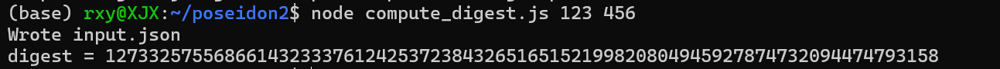

# Project3

## 一、Poseidon2 算法

Poseidon2 是针对零知识证明（ZKPs）优化的哈希函数家族 Poseidon 的改进版本，其设计目标是在保持安全性的同时尽可能减少电路约束数，从而降低 zkSNARK 中的证明生成与验证成本。

**特点**：

* **有限域参数**：本项目使用 BN254 的模 p。

* **状态大小 t**：状态向量长度， t=3 代表 3 个 field 元素。

* **S-box**：非线性变换采用幂指数 d=5，即 S(x) = x⁵ mod p。这个选择在 ZK 场景下平衡了非线性与约束数。

* **轮结构**：包括全轮（Full Rounds, RF）与部分轮（Partial Rounds, RP）。全轮对所有状态元素应用 S-box，部分轮只对一个状态元素应用 S-box，从而减少电路复杂度。

* **线性层**：状态经过固定的 MDS 矩阵乘法，实现高扩散性。矩阵与轮常量是算法安全性的关键部分。

* **常量注入**：每轮开始前将预先生成的轮常量 RC 加入到状态中。

---

## 二、Poseidon2的JavaScript实现（ `compute_digest.js`）

该 JS 文件作用是：

* 读取用户输入作为哈希原像，执行 Poseidon2 算法计算哈希值。
* 生成 `input.json`，用于 witness 生成。

**代码实现**：

* 使用 BN254 素数域 p 进行模运算。
* `t=3`，RF 与 RP 通过`generate_params_poseidon.sage`得到。
* 常量 RC 与 M 硬编码在文件中。
* `pow5` 函数实现 S-box。
* 输出 JSON 格式与 circom 电路输入信号名对应。
* 读取两个输入值与一个预置 0（capacity 元素）构成初始状态。

---

## 三、circom 电路（`poseidon2.circom`）

电路的基本结构：

* **输入声明**：
    signal input in[2];      // 私有输入：原像（初始状态还包括一个预置的0作为capacity 元素）
    signal input digest;     // 公共输入：哈希值

* **常量声明**：RC\_flat、M\_flat 硬编码，与 JS 相同。

* **运算模块**：
  
  * `Exp5()` 子电路：实现 x⁵。
  * 轮迭代逻辑：全轮与部分轮分别调用 Exp5 并进行矩阵乘法。

* **约束**：最后输出计算得到的哈希，与 `digest` 做约束相等。

---

## 四、Groth16 算法

Groth16 是一种高效的 zkSNARK 协议，其核心思想是将电路（计算）转换为约束系统（R1CS），并通过多项式承诺与配对运算生成简短可验证的证明。

**流程**：

1. **电路编译**：将 circom 电路编译为 R1CS，确定约束关系。
2. **Powers of Tau（Phase 1）**：生成与电路无关的公共参数，支持不同电路重用。
3. **Phase 2**：结合特定电路 R1CS，生成与电路相关的 proving/verifying key。
4. **证明生成**：给定 witness（满足电路约束的输入集合），生成一个短证明（proof.json）。
5. **验证**：使用验证密钥检查证明的正确性，确保输入满足电路约束而不泄露隐私。

---

## 五、 示例流程

```bash
# 生成 Poseidon2 所需的 RC 与 M 常量
sage generate_params_poseidon.sage 1 0 254 3 5 128 0x30644e72e131a029b85045b68181585d2833e84879b9709143e1f593f0000001

# 根据输入计算 digest，并生成 `input.json`（包含私有输入和公开输入 digest）
node compute_digest.js 123 456

# 编译电路，生成 R1CS 文件、WASM 计算文件和符号文件
circom poseidon2.circom --r1cs --wasm --sym

# 生成witness
node ./poseidon2_js/generate_witness.js  ./poseidon2_js/poseidon2.wasm input.json witness.wtns

# 生成通用参数
snarkjs powersoftau new bn254 14 pot14_0.ptau
# 添加随机性
snarkjs powersoftau contribute pot14_0.ptau pot14_1.ptau --name="First contribution"
# 生成与电路结合的 Phase 2 参数文件
snarkjs powersoftau prepare phase2 pot14_1.ptau pot14.ptau

# 生成初始 zkey
snarkjs groth16 setup poseidon2.r1cs pot14.ptau poseidon2_0.zkey
# 添加随机性，生成最终 zkey
snarkjs zkey contribute poseidon2_0.zkey poseidon2.zkey --name="First contribution"
# 导出验证密钥
snarkjs zkey export verificationkey poseidon2.zkey verification_key.json

# 生成证明
snarkjs groth16 prove poseidon2.zkey witness.wtns proof.json public.json
# 验证证明
snarkjs groth16 verify verification_key.json public.json proof.json

# 导出witness.json
snarkjs wtns export json witness.wtns witness.json
```

## 六、示例结果

### 1.生成参数常量


### 2.js代码计算哈希值并生成输入文件



### 3.编译电路


### 4.生成witness


### 5.生成 Powers of Tau


### 6.Groth16 zkKey setup


### 7.生成proof并验证


