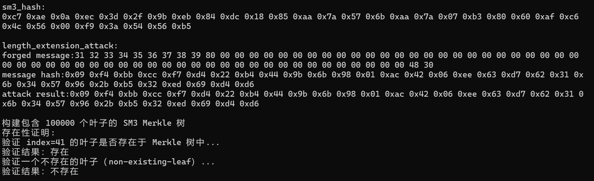

# Project4说明文档

## 一、SM3算法简介

SM3是中国国家密码管理局发布的密码杂凑算法标准（GM/T 0004-2012），其输出长度为256位。其算法结构与SHA-256类似，但在压缩函数和常量生成等细节上有所不同，具有更高的安全性和更强的抵抗差分攻击能力。

### 主要流程如下：

1. **填充消息**：将输入补齐至512比特的整数倍。
2. **消息扩展**：将原始消息块扩展成68个W[j]和64个W'[j]。
3. **压缩函数**：对每个消息块执行64轮压缩操作，结合轮常量Tj和布尔函数FFj/GGj。
4. **输出结果**：最终杂凑值由初始值与压缩结果异或组成。

---

## 二、优化实现说明

本优化实现针对X86-64架构，使用纯C语言编写，目标是在保持通用性的基础上提升运行效率。具体优化如下：

### 1. **轮函数宏定义展开**

使用宏`ROUND(...)`代替函数调用，实现轮函数的**循环展开**，从而消除函数调用开销，提高执行速度和编译器优化能力。

```c
#define ROUND(A,B,C,D,E,F,G,H,Wj,WjP,Tj,j) ...
```

### 2. **消息扩展优化**

在`sm3_compress`中，使用循环一次性完成W[0..67]与W'[0..63]的计算，避免重复运算，提高处理效率。

```c
W[j] = P1(W[j - 16] ^ W[j - 9] ^ ROTL(W[j - 3], 15)) ^ ROTL(W[j - 13], 7) ^ W[j - 6];
W'[j] = W[j] ^ W[j + 4];
```

### 3. **寄存器使用**

使用A-H八个变量模拟8个工作寄存器，在64轮运算中直接参与计算，**避免内存读写**，提升寄存器利用率。

```c
uint32_t A, B, C, D, E, F, G, H;
```

### 4. **静态控制流展开**

控制逻辑中避免条件判断，将所有操作编译期展开，便于指令流水线执行，减少分支预测开销。

```c
uint32_t Tj = (j < 16) ? Tj15 : Tj63;
```

### 5. **单轮数据反馈整合**

最后将结果直接反馈到V中，节省中间变量和内存操作：

```c
V[0] ^= A; V[1] ^= B; ... V[7] ^= H;
```

---

## 三、length-extension-attack原理

SM3 是基于 Merkle–Damgård 结构的密码杂凑函数，其安全性部分依赖于压缩函数的抗碰撞性。但由于其迭代结构存在状态可继承性，因此可以被用于实施**长度扩展攻击（Length Extension Attack）**。

### 原理简述：

- SM3 的压缩函数以 512 位消息块为单位处理数据，输出 256 位摘要；
- 每轮处理输出的中间状态将作为下一轮的输入；
- 因此若攻击者知道 `SM3(m)` 和消息 `m` 的长度，就可以恢复中间状态向量 `V`，然后在此基础上构造新的伪造消息 `m || pad(m) || m'`；
- 只需执行一次 SM3 压缩函数，即可得到 `SM3(m || pad(m) || m')`，而无需知道原始 `m` 内容。

这种攻击能够伪造“看似由合法用户构造”的新哈希值，因此在数字签名、HMAC 等场景中，SM3 应**始终搭配密钥（HMAC）使用**。

---

## 四、length-extension-attack代码实现说明

代码主要分为以下几个步骤：

### 1. 恢复中间状态 `V`

```c
void hash_to_IV(const uint8_t hash[32], uint32_t V[8]) {
    for (int i = 0; i < 8; ++i) {
        V[i] = ((uint32_t)hash[i * 4] << 24) |
            ((uint32_t)hash[i * 4 + 1] << 16) |
            ((uint32_t)hash[i * 4 + 2] << 8) |
            ((uint32_t)hash[i * 4 + 3]);
    }
}
```

该函数将原始 SM3 输出（32字节）还原为 8 个 32 位寄存器，作为压缩函数的初始状态。

---

### 2. 计算原始消息长度对应的 padding 长度

```c
size_t forged_offset = ((original_len + 9 + 63) / 64) * 64;
```

该计算用于确定原始消息经过 SM3 填充后的总长度。这个长度决定了追加消息在整体 forged message 中的起始位置。

---

### 3. 构造追加数据 + padding

```c
    *pad = (uint8_t*)calloc(1, total);
    memcpy(*pad, msg, len);
    (*pad)[len] = 0x80;
    uint64_t bitlen = len * 8;
...
```

padding 的 bitlen 值应对应整个伪造消息的比特长度，包括原始消息及其 padding，再加上追加数据。

---

### 4. 使用旧状态 V 处理新追加的数据

```c
for (size_t i = forged_offset; i < new_padded_len; i += 64)
    sm3_compress(V, buffer + i);
```

此步骤将伪造的“追加消息”输入 SM3 压缩函数，起始状态为原始哈希恢复得到的中间状态 `V`。

---

### 5. 构造伪造的完整消息并验证

```c
    uint8_t* pad = NULL;
    size_t pad_len = sm3_padding(data, strlen(data), &pad);
    size_t forged_len = pad_len + strlen(append);
    uint8_t* forged_msg = (uint8_t*)malloc(forged_len);
    memcpy(forged_msg, pad, pad_len);
    memcpy(forged_msg + pad_len, append, strlen(append));
```

这个“完整伪造消息”将用于验证攻击是否成立 —— 即它的 SM3 值应与扩展攻击生成的哈希一致。

---

## 五、攻击效果验证

通过比较：

- 利用 `sm3_length_extension_attack()` 得到的伪造哈希；
- 用 `sm3_hash(forged_msg)` 对完整伪造消息重新计算得到的哈希；

若两者一致，则表明攻击成功。

---

## 六、Merkle 树

Merkle 树是一种基于哈希函数构建的**二叉树结构**，可以有效地用于验证数据的完整性。每个叶子节点是数据的哈希值，内部节点为其子节点哈希拼接后的再哈希。Merkle 树根（Merkle Root）是所有叶子哈希的“摘要”，可用于高效验证单个数据是否属于树的一部分。

### 1. 单个叶子构造

使用 SM3 哈希函数处理字符串内容，生成每个叶子节点：

```c
char buf[32];
sprintf(buf, "leaf-%d", i);
sm3_hash((uint8_t *)buf, strlen(buf), leaves[i]);
```

若有 100000 个节点，即为：

```
leaves[0] = SM3("leaf-0")
leaves[1] = SM3("leaf-1")
...
leaves[99999] = SM3("leaf-99999")
```

### 2. 构建中间节点与 Merkle 根

每一对相邻叶子 `L`, `R` 被拼接并再次哈希，生成其父节点：

```c
void hash_concat(const uint8_t *left, const uint8_t *right, uint8_t hash[32]) {
    uint8_t buf[64];
    memcpy(buf, left, 32);
    memcpy(buf + 32, right, 32);
    sm3_hash(buf, 64, hash);
}
```

树的构建采用递归向上传播，直到得到 Merkle 根：

```c
uint8_t *build_merkle_root(uint8_t **leaves, size_t count);
```

---

## 七、存在性证明

### 原理：

给定一个叶子，其存在性可以通过一条Merkle Proof来验证。这条路径包括从该叶子到 Merkle 根所需的每层兄弟节点的哈希值。

验证时，逐层将当前哈希与对应兄弟节点拼接并哈希，最终结果应等于 Merkle 根。

### 实现步骤：

#### 1. 生成 Merkle 路径：

```c
size_t get_merkle_proof(uint8_t **leaves, size_t count, size_t index, uint8_t ***proof_out);
```

此函数收集给定 `index` 节点的兄弟节点哈希值，构成证明路径。

#### 2. 验证存在性：

```c
int verify_merkle_proof(const uint8_t *leaf, size_t index, size_t total,
                        uint8_t **proof, size_t depth, const uint8_t *expected_root);
```

它将 leaf 沿路径与每一层的 sibling 哈希逐层拼接，最终结果应等于 Merkle 根。

#### 3. 示例：

```c
uint8_t **proof = NULL;
size_t depth = get_merkle_proof(leaf_copy, LEAF_COUNT, test_index, &proof);
int valid = verify_merkle_proof(leaf, test_index, LEAF_COUNT, proof, depth, tree->root);
```

---

## 八、不存在性证明

### 原理：

Merkle 树本身并**不能直接证明某个元素不存在**，但可通过以下方式间接达成：

- 若尝试验证一个未加入树的叶子，必然在路径中哈希不匹配；
- 可伪造一个假叶子（如 SM3("non-existing-leaf")）并构造随机路径；
- 验证函数将失败，提示该节点并非该 Merkle 树的一部分。

### 示例：

```c
uint8_t fake_leaf[32];
sm3_hash((const uint8_t *)"non-existing-leaf", 18, fake_leaf);

int fake_valid = verify_merkle_proof(fake_leaf, 123456, LEAF_COUNT, proof, depth, tree->root);
```

---

## 九、示例结果


