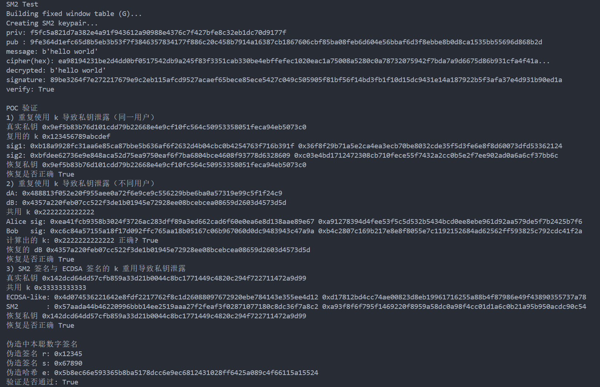

# 

## Project5

## 一、SM2 算法

SM2 是基于椭圆曲线公钥密码的国家标准，使用的曲线为 **sm2p256v1**，定义在素域 $F_p$

上。

### 1.1 核心运算

- **域运算**：模加、模减、模乘、模逆
- **椭圆曲线运算**：点加、点倍
- **标量乘**：计算 k·P，是加解密与签名的核心

### 1.2 加解密流程

- **加密**  
  
  1. 随机 k ∈ [1, n−1]  
  2. C1 = k·G  
  3. S = k·P（接收方公钥）  
  4. t = KDF(x2 || y2, klen)  
  5. C2 = M ⊕ t  
  6. C3 = SM3(x2 || M || y2)  
  7. 输出 C = C1 || C3 || C2

- **解密**  
  
  1. 从 C 解析出 C1、C3、C2  
  2. S = d·C1（私钥）  
  3. t = KDF(x2 || y2, klen)  
  4. M = C2 ⊕ t  
  5. u = SM3(x2 || M || y2)，验证 u = C3

### 1.3 签名/验签

- **签名**  
  
  1. 计算 ZA = SM3(ENTL || ID || a || b || Gx || Gy || xA || yA)  
  2. e = SM3(ZA || M)  
  3. 随机 k  
  4. r = (e + x1) mod n  
  5. s = ((1 + dA)⁻¹ · (k − r·dA)) mod n  
  6. 输出 (r, s)

- **验签**  
  
  1. 计算 ZA、e  
  2. t = (r + s) mod n  
  3. X = s·G + t·PA  
  4. R = (e + x1) mod n  
  5. 验证 R = r

---

## 二、优化及对应原理和代码

### 2.1 Jacobian 坐标减少模逆

- **原理**：仿射坐标每次加法/倍点需 1 次模逆，Jacobian 坐标将模逆延迟到最后一次仿射转换，减少约 90% 模逆操作。
- **代码**：
  - `to_jacobian()` / `from_jacobian()`：坐标转换
  - `point_double_j()` / `point_add_j()`：雅可比坐标下的加法/倍点
  - 所有标量乘内部均用 Jacobian 表示点

### 2.2 固定点（G）窗口预计算

- **原理**：固定点乘（k·G）频繁出现，预先计算 G 的多倍点表（1G, 2G, …, (2^w−1)G），标量乘时分组查表，减少在线点加次数。
- **代码**：
  - `build_fixed_window_table()`：构建窗口表（w=4）
  - `fixed_point_mul()`：使用窗口法执行 k·G

### 2.3 非固定点 NAF 编码

- **原理**：非相邻形式（NAF）编码使标量乘中非零位比例降至约 1/3，减少点加次数。
- **代码**：
  - `compute_naf()`：生成 NAF 表示
  - `mul_point_naf()`：按 NAF 遍历执行倍点和点加

### 2.4 延迟模逆

- **原理**：标量乘和加法内部全用 Jacobian，最后 `from_jacobian()` 时一次性模逆，避免重复运算。

---

## 三、 SM2 签名与Poc

**SM2 签名算法）步骤如下：**

- **公共参数：椭圆曲线参数 $(p, a, b, G, n)$**
- **私钥：$d \in [1, n-1]$  
  公钥：$P = dG$**
- **签名：**
  1. **计算 $e = \mathrm{SM3}(M)$**
  2. **选择随机数 $k \in [1, n-1]$**
  3. **计算 $C_1 = kG = (x_1, y_1)$**
  4. **$r = (e + x_1) \bmod n$**
  5. **$s = ((1+d)^{-1} \cdot (k - r d)) \bmod n$**
  6. **签名为 $(r, s)$**

**随机数 $k$ 是签名安全的核心，一旦泄露或被复用，会导致私钥 $d$ 泄露。**

---

## 四、漏洞场景与数学推导

### 1. 同一用户复用相同 $k$

对两条不同消息 $M_1, M_2$ 使用相同 $k$：$ \begin{cases}s_1 = (1+d)^{-1} (k - r_1 d) \\s_2 = (1+d)^{-1} (k - r_2 d)\end{cases} $相减消去 $k$：$ d = \frac{s_1 - s_2}{r_2 - r_1 - s_1 + s_2} \bmod n $

### 2. 不同用户复用相同 $k$

Alice 和 Bob 使用相同 $k$：$ s_A = (1+d_A)^{-1}(k - r_A d_A) \\s_B = (1+d_B)^{-1}(k - r_B d_B) $若 Alice 知道自己的 $d_A$，可先求：$ k = s_A + d_A(r_A + s_A) \bmod n$再恢复 Bob 的私钥：$ d_B = (k - s_B) (r_B + s_B)^{-1} \bmod n $

### 3. SM2 与 ECDSA 共用相同 $k$

ECDSA：$ s_1 = k^{-1}(e_1 + d r_1) \Rightarrow k = (e_1 + d r_1) s_1^{-1} $SM2：$ s_2 = (1+d)^{-1}(k - r_2 d) \Rightarrow k = s_2(1+d) + r_2 d $

联立可得：

$ d = (s_1 s_2 - e_1) (r_1 - s_1(r_2 + s_2))^{-1} \bmod n $

---

## 五、PoC 验证代码说明

在 `SM2` 类中新增了两个方法：

```python
def sign_with_k(self, msg: bytes, k: int): 
# 使用固定 k 进行 SM2 签名 
... 

def ecdsa_sign_with_k(self, msg: bytes, k: int): 
# 使用固定 k 进行 ECDSA 签名
 ...
```

### PoC 1：同一用户复用 k

函数：`poc_k_reuse_same_user()`通过两次签名差分直接恢复私钥。

### PoC 2：不同用户复用 k

函数：`poc_k_reuse_cross_users`Alice 通过自己的 k推导出 Bob 的私钥。

### PoC 3：SM2 与 ECDSA 共用 k

函数：`ppoc_ecdsa_sm2_crossreuse()`利用两种算法公式的差异，联立方程解出私钥。

---


## 六、伪造中本聪签名

### 原理

SM2 验签的关键步骤：

* 验签计算：
  1. 计算 `t = (r + s) mod n`
  2. 计算点：`X = s*G + t*PA`，记 `X = (x1, y1)`
  3. 计算 `R = (e + x1) mod n`
  4. 验证 `R == r`

因此，若我们选定 `r` 和 `s`（满足合法性），并事先知道公钥 `PA`，我们可以：

1. 计算 `t = (r + s) mod n`
2. 计算 `X = s*G + t*PA` 并得到 `x1`
3. 令 `e = (r - x1) mod n`，则 `R = (e + x1) mod n = r`，验签通过

通过上述过程构造伪造不需要私钥，给定合法公钥与 `(r,s)`，都可以构造一个 `e` 使得验签接受。

`e` 是 `SM3(ZA || M)` 的结果，其中 `M` 是消息，`ZA` 包含了公钥信息等。攻击者若希望将伪造 `(e,r,s)` 对应到一个真实消息 `M`，需要使 `SM3(ZA || M) == e` —— 这相当于寻找碰撞，实际中并不可行。

**如果验签方只检查 `(e,r,s)` 的数学关系而没有确保 `e` 源自真实消息的哈希（或没有绑定到消息/ID/ZA），则存在伪造风险。**

### 代码

```python
def verify_forged_signature(e: int, r: int, s: int, pub_point: tuple) -> bool:
...


def poc_forge_satoshi_signature():
...
```

## 七、示例结果


